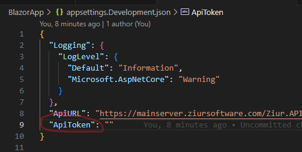

## Blazor Web App

Web application built with Blazor to retrieve information from an API and
display it on a responsive grid.

#### Execute:
You can configure UserSecret with Blazor by accessing the project root 
and running these two commands:

```
    dotnet user-secrets init
    dotnet user-secrets set "ApiToken" "valor del token de acceso"
```

#### ó

Add the token to ApiTpken within the appsettings.Development.json file 
and keep the token locally, but it is more recommended to use the option above.



